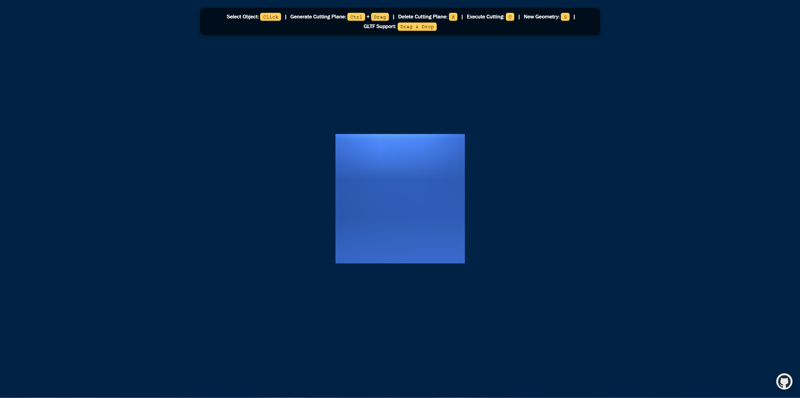
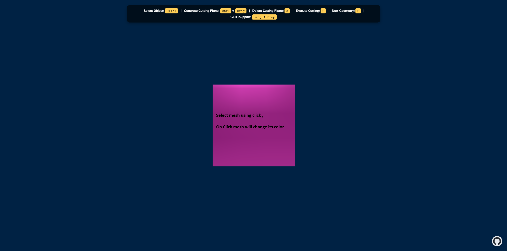
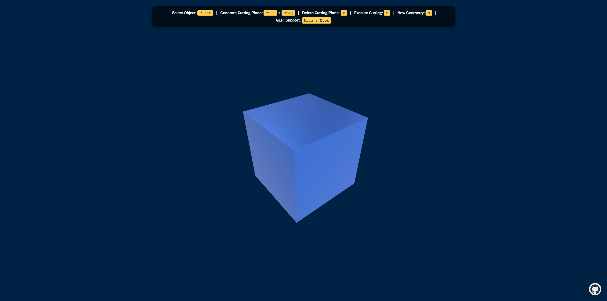
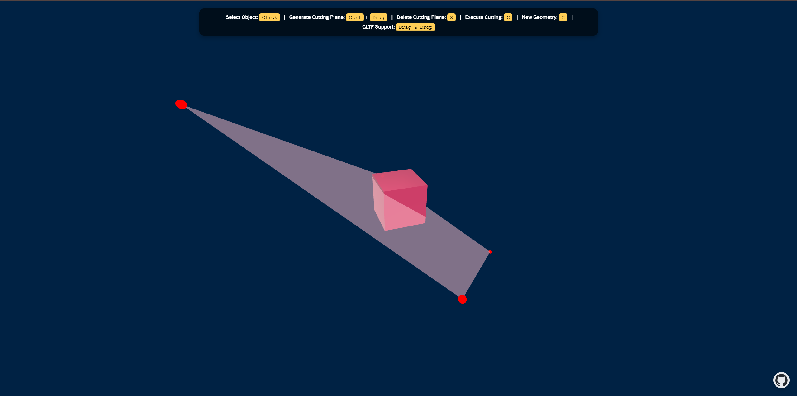
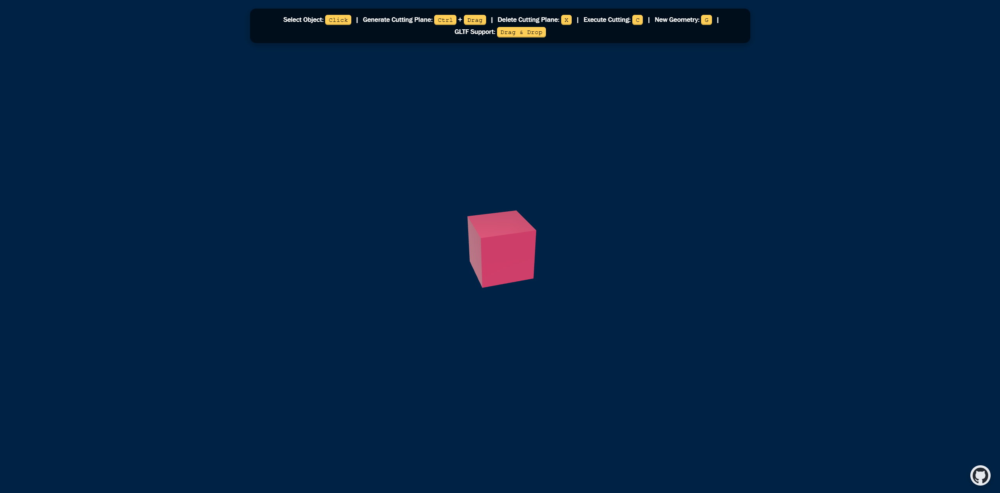
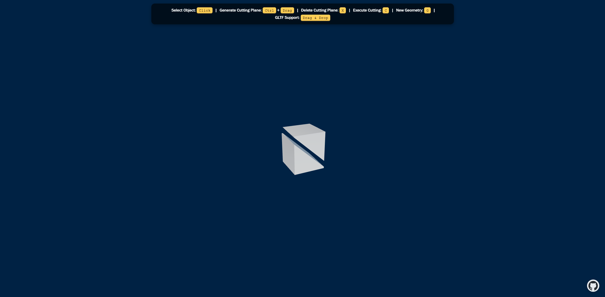
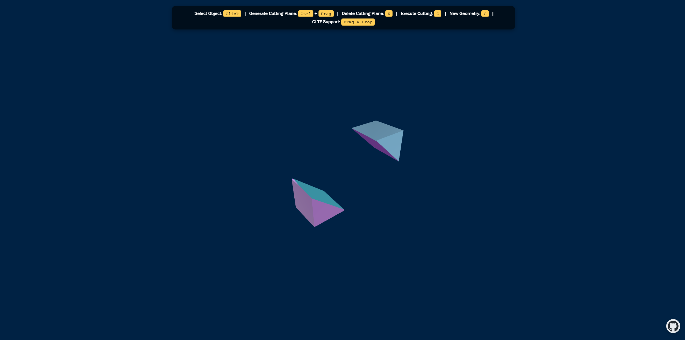
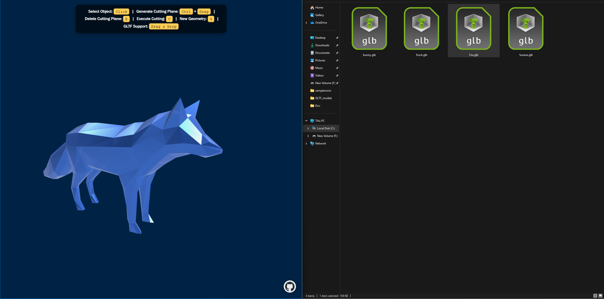

# Computational Solid Geometry 🚀



**Computational Solid Geometry** is a project that enables slicing of solid geometries created with Three.js. CSG (Constructive Solid Geometry) operations are powered by the **three-mesh-bvh-csg** library, while slicing is performed interactively using a **cutting plane**.

---

## Tech for Real-Time Rendering

**WebGL 2.0** – The primary rendering API used in this project, providing access to GPU-accelerated graphics within the browser.

**Three.js** – A powerful and widely-used JavaScript library for 3D graphics, simplifying the process of creating and rendering 3D scenes in the browser. Three.js serves as the core framework for rendering geometries and GLTF models.

---

## Computer Graphics Concepts

1. [Constructive Solid Geometry](https://en.wikipedia.org/wiki/Constructive_solid_geometry)  
2. [Bounding Volume Hierarchy](https://en.wikipedia.org/wiki/Bounding_volume_hierarchy)  
3. [Raycasting](https://github.com/gkjohnson/three-mesh-bvh)  

---

## How to Use

1. **Open the project in a browser.**  
   

2. **Select an element** by clicking on it. The selected mesh will change its color.  
   

3. **Use orbit controls** to rotate the 3D scene and find your preferred angle for slicing.  
   

4. **Create a cutting plane** by holding the Control key and dragging the mouse.  
   

5. **Undo a cutting plane** by pressing the "X" key if you're not satisfied with the result.  
   

6. **Slice the mesh** into two parts by pressing the "C" key.  
   

7. **Select and move separated meshes independently.**  
   

8. **Load GLTF models** by dragging files from your local file explorer. This repository includes sample GLTF models from the [KhronosGroup GLTF Sample Models](https://github.com/KhronosGroup/glTF-Sample-Models/tree/main/2.0).  
   

---

## Installation

```bash
git clone https://github.com/amitdubey6261/computational-solid-geometry
npm install
npm run dev
```

---

## Acknowledgments

A huge thanks to the brilliant minds behind the tools that made this project possible:

- [Mr. Doob](https://x.com/mrdoob?lang=en) – Creator of Three.js, the backbone of browser-based 3D graphics.  
- [Garrett Johnson](https://x.com/garrettkjohnson?lang=en) – Developer of Three-Mesh-BVH, essential for efficient rendering and geometry slicing.

